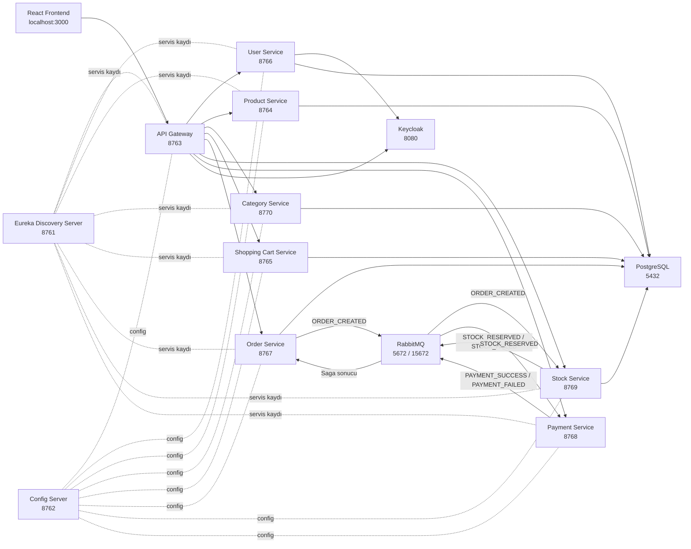

# N11 Bootcamp Microservice E-Commerce Project

Bu proje, Spring Boot mikroservis mimarisi ile geliştirilmiş basit bir e-ticaret uygulamasıdır. Backend tarafında ürün listeleme, kullanıcı işlemleri, sepet yönetimi, sipariş oluşturma, stok kontrolü ve ödeme akışı ayrı servisler üzerinden çalışır. Frontend tarafında React ve Vite ile hazırlanmış sade bir kullanıcı arayüzü vardır.

Amaç; mikroservis mimarisi, servisler arası haberleşme, JWT güvenliği, saga tabanlı sipariş akışı, Docker ile çalıştırma, Swagger dokümantasyonu ve temel test pratiğini bir arada gösterebilen anlaşılır bir demo oluşturmaktır.

## Teknolojiler

- Java 21
- Spring Boot
- Spring Cloud Config
- Netflix Eureka Discovery Server
- Spring Cloud Gateway
- Spring Security ve JWT
- Keycloak
- PostgreSQL
- RabbitMQ
- Docker Compose
- Jib
- Swagger / OpenAPI
- JUnit 5 ve Mockito
- React, Vite, React Router

## Mimari

Projede her ana iş parçası ayrı bir servis olarak ele alınmıştır.

| Servis | Port | Açıklama |
| --- | ---: | --- |
| discovery-server | 8761 | Eureka servis keşfi |
| config-server | 8762 | Merkezi konfigürasyon |
| api-gateway | 8763 | Frontend'in backend servislerine giriş noktası |
| product-service | 8764 | Ürün listeleme, detay ve ürün yönetimi |
| shopping-cart-service | 8765 | Kullanıcı sepeti işlemleri |
| user-service | 8766 | Kullanıcı kayıt ve giriş işlemleri |
| order-service | 8767 | Sipariş oluşturma ve sipariş durum yönetimi |
| payment-service | 8768 | Ödeme işlemleri ve ödeme sonucu üretimi |
| stock-service | 8769 | Stok kontrolü ve rezervasyon |
| category-service | 8770 | Kategori işlemleri |

Yardımcı servisler:

| Servis | Port | Açıklama |
| --- | ---: | --- |
| PostgreSQL | 5432 | Ürün, kullanıcı, sepet, sipariş ve stok verileri |
| RabbitMQ | 5672 / 15672 | Saga event akışı ve yönetim arayüzü |
| Keycloak | 8080 | JWT tabanlı authentication |

## Mikroservis Diyagramı



## Sipariş Saga Akışı

Sipariş süreci asenkron olarak ilerler.

1. Kullanıcı frontend üzerinden sepetini hazırlar.
2. Checkout ekranında ödeme bilgileri ile sipariş oluşturulur.
3. `order-service` siparişi oluşturur ve `ORDER_CREATED` event'i yayınlar.
4. `stock-service` stok kontrolü yapar.
5. Stok uygunsa `STOCK_RESERVED`, uygun değilse `STOCK_FAILED` event'i yayınlanır.
6. `payment-service` ödeme adımını çalıştırır.
7. Ödeme başarılıysa sipariş tamamlanır.
8. Stok veya ödeme hatasında sipariş iptal edilir.

Bu akış sayesinde order, stock ve payment servisleri birbirine doğrudan bağımlı olmadan RabbitMQ üzerinden haberleşir.

## Güvenlik

Projede JWT tabanlı güvenlik kullanılmaktadır.

- Login ve register işlemleri `user-service` üzerinden yapılır.
- Token üretimi Keycloak ile sağlanır.
- Korumalı endpointlerde `Authorization: Bearer <token>` header'ı kullanılır.
- Ürün listeleme gibi public endpointler login olmadan görüntülenebilir.
- Sepet, checkout ve sipariş geçmişi gibi kullanıcıya bağlı işlemler token gerektirir.

## Frontend

Frontend şu anda geliştirme sürecinde ayrı bir React projesi olarak tutulmaktadır:

```text
C:\Users\Berkay\Desktop\Yeni klasör\java\n11bootcamp-frontend
```

Proje teslimine doğru frontend uygulaması da backend ile aynı repoya taşınarak tek repository yapısı altında tutulacaktır.

Frontend özellikleri:

- Login ve register ekranları
- LocalStorage ile kullanıcı/token saklama
- Ürün listeleme
- Ürün detay sayfası
- Kategori filtresi
- Ürün adına göre arama
- Pagination UI
- Backend destekli sepet işlemleri
- Checkout ekranı
- Demo kart bilgileri ile ödeme başlatma
- Sipariş sonucu için kullanıcı dostu başarı/hata mesajları
- Sipariş geçmişi sayfası
- Loading ve hata state'leri

Frontend'i çalıştırmak için:

```bash
cd "C:\Users\Berkay\Desktop\Yeni klasör\java\n11bootcamp-frontend"
npm install
npm run dev
```

Frontend varsayılan olarak şu adreste çalışır:

```text
http://localhost:3000
```

## Docker ile Çalıştırma

Backend servisleri ve yardımcı servisler Docker Compose ile ayağa kaldırılır.

Iyzico sandbox bilgileri gibi hassas değerler `.env` dosyasından okunur. Örnek dosyayı kopyalayıp kendi değerlerinle doldurabilirsin:

```bash
copy .env.example .env
```

Gerekli Iyzico değişkenleri:

```text
IYZICO_BASE_URL
IYZICO_API_KEY
IYZICO_SECRET_KEY
```

```bash
docker compose up -d
```

Durumu kontrol etmek için:

```bash
docker compose ps
```

Kapatmak için:

```bash
docker compose down
```

Veritabanı volume dahil tamamen temizlemek için:

```bash
docker compose down -v
```

Not: `docker compose down -v` komutu PostgreSQL ve RabbitMQ volume'larını da siler. Bu durumda başlangıç verileri `docker/postgres/init.sql` üzerinden yeniden oluşturulur.

## Docker Compose İyileştirmeleri

Servislerin doğru sırayla başlaması için `docker-compose.yml` dosyasında healthcheck ve `depends_on` koşulları düzenlendi.

Başlangıç sırası temel olarak şöyledir:

1. PostgreSQL, RabbitMQ, Keycloak ve Discovery Server
2. Config Server
3. Product, Category, User, Shopping Cart, Order, Stock ve Payment servisleri
4. API Gateway

Bu sayede gateway, arkadaki servisler hazır olmadan trafik almamaya çalışır.

## Jib ile Image Build

Servisler Dockerfile yazmadan Jib ile image haline getirilebilir.

Örnek:

```bash
cd order-service
.\mvnw.cmd -DskipTests jib:dockerBuild
```

Her servis kendi klasöründe aynı mantıkla build edilebilir.

## Veritabanı Başlangıç Verileri

PostgreSQL container ilk kez oluşturulduğunda `docker/postgres/init.sql` çalışır. Bu dosyada demo ürünler, kategoriler, stok kayıtları ve sepet tabloları için gerekli başlangıç verileri bulunur.

Bu sayede yeni bir Docker ortamı ayağa kalktığında ürün listeleme ve demo akışı için gerekli temel kayıtlar hazır gelir.

## Swagger / OpenAPI

Swagger UI adresleri:

| Servis | Swagger UI |
| --- | --- |
| API Gateway | http://localhost:8763/swagger-ui/index.html |
| Product | http://localhost:8764/swagger-ui/index.html |
| Shopping Cart | http://localhost:8765/swagger-ui/index.html |
| User | http://localhost:8766/swagger-ui/index.html |
| Order | http://localhost:8767/swagger-ui/index.html |
| Payment | http://localhost:8768/swagger-ui/index.html |
| Stock | http://localhost:8769/swagger-ui/index.html |
| Category | http://localhost:8770/swagger-ui/index.html |

OpenAPI JSON için örnek:

```text
http://localhost:8764/v3/api-docs
```

## Testler

Projede servis katmanı ve event listener davranışları için unit testler eklendi.

Test yazılan örnek alanlar:

- Product service
- Category service
- User service
- Shopping cart service
- Order service
- Order stock result listener
- Stock service
- Stock listener
- Payment listener

Tek bir servisin testlerini çalıştırmak için:

```bash
cd product-service
.\mvnw.cmd test
```

Belirli bir test sınıfını çalıştırmak için:

```bash
.\mvnw.cmd -Dtest=ProductServiceTest test
```

IntelliJ IDEA üzerinden test sınıfının yanındaki yeşil run butonu ile de testler çalıştırılabilir.

## Loglama ve Hata Yönetimi

Projede saga akışını takip edebilmek için order, stock ve payment servislerinde loglar sadeleştirildi ve standart hale getirildi.

Örnek log akışı:

```text
ORDER_CREATED
STOCK_RESERVED
PAYMENT_STARTED
IYZICO_PAYMENT_STARTED
IYZICO_RESPONSE_RECEIVED
PAYMENT_SUCCESS
```

Ayrıca servislerde global exception handling eklenerek controller katmanındaki tekrar eden try-catch yapıları azaltıldı. Böylece hata mesajları daha merkezi ve okunabilir hale getirildi.

## Ödeme Akışı

Ödeme akışı saga üzerinden tekilleştirildi. Checkout ekranından gelen ödeme bilgileri sipariş oluşturma isteğiyle backend'e taşınır. Payment işlemi controller üzerinden ayrıca tetiklenmez; sipariş akışında stok kontrolünden sonra `payment-service` tarafından yürütülür.

Iyzico sandbox entegrasyonu için ilk bağlantı çalışması yapıldı. Test ortamında ödeme sonucu loglanır ve sipariş durumu buna göre güncellenir.

Iyzico API key ve secret key değerleri kod içinde tutulmaz. `payment-service` bu bilgileri environment variable üzerinden okur:

```text
IYZICO_BASE_URL
IYZICO_API_KEY
IYZICO_SECRET_KEY
```

## Demo Kullanıcı

Demo testlerinde kullanılan kullanıcı:

```text
username: demo
password: password
```

## Kullanışlı Linkler

| Alan | URL |
| --- | --- |
| Frontend | http://localhost:3000 |
| Eureka Dashboard | http://localhost:8761 |
| API Gateway | http://localhost:8763 |
| Keycloak | http://localhost:8080 |
| RabbitMQ Management | http://localhost:15672 |

RabbitMQ varsayılan kullanıcı bilgileri:

```text
username: guest
password: guest
```

Keycloak admin kullanıcı bilgileri:

```text
username: admin
password: admin
```

## Şu Ana Kadar Yapılanlar

- Mikroservisler Docker Compose ile birlikte çalışacak hale getirildi.
- Discovery, Config ve Gateway akışı düzenlendi.
- PostgreSQL, RabbitMQ ve Keycloak compose içine alındı.
- Ürün listeleme, kategori, arama ve pagination desteklendi.
- Shopping cart backend servisi frontend'e bağlandı.
- Checkout ekranı eklendi.
- Order, stock ve payment saga akışı test edildi.
- Stok yetersizliği ve ödeme hatası kullanıcıya anlaşılır mesajlarla gösterildi.
- Sipariş geçmişi ekranı eklendi.
- Global exception handling eklendi.
- Saga logları sadeleştirildi.
- Kullanılmayan order dosyaları temizlendi.
- Docker başlangıç verileri `init.sql` ile toparlandı.
- Unit testler eklendi.
- Swagger UI üzerinden servis dokümantasyonu kontrol edilebilir hale getirildi.

## Kalan / Geliştirilebilir Alanlar

- Frontend projesinin backend repository içine taşınması
- CI/CD pipeline eklenmesi
- Jenkins ve GitHub Actions karşılaştırma dokümanı
- AWS Elastic Beanstalk ve RDS deployment hazırlığı
- Merkezi loglama veya monitoring kurulumu
- Admin panel ile ürün/stok yönetimi
- Daha kapsamlı integration testler
